# AI System Design Generator

Transform your system descriptions into professional diagrams using AI and Mermaid.js

[](https://github.com/your-username/ai-system-designer/deployments)
[](https://opensource.org/licenses/MIT)

## Features

- **AI-Powered Generation**: Uses Google Gemini API to convert natural language descriptions into Mermaid diagrams
- **Unified Interface**: Streamlined layout with all inputs and code editing in one panel, diagram prominently displayed
- **Live Code Editor**: Edit Mermaid code with real-time preview updates
- **Interactive Zoom & Pan**: Zoom in/out, pan around large diagrams, mouse wheel support
- **Multiple Diagram Types**: Supports flowcharts, sequence diagrams, class diagrams, state diagrams, and more
- **Dark & Light Mode**: Complete theme switching with true black dark mode
- **Export Options**: Download diagrams as SVG or PNG files
- **Code Formatting**: Auto-format Mermaid code with proper indentation
- **Responsive Design**: Works perfectly on desktop, tablet, and mobile devices
- **GitHub Pages Ready**: Static deployment with no build process required

## System Design

```mermaid
graph TB
    subgraph "User Interface Layer"
        UI["🌐 Web Interface<br/>HTML/CSS/JavaScript"]
        Input["📝 System Description<br/>Text Input"]
        CodeEditor["✏️ Live Code Editor<br/>Mermaid Syntax"]
        DiagramDisplay["📊 Diagram Preview<br/>Real-time Rendering"]
        ThemeToggle["🌙 Theme Toggle<br/>Light/Dark Mode"]
    end
    
    subgraph "Application Core"
        App["🎮 Main Controller<br/>SystemDesignGenerator"]
        API["🔌 API Client<br/>Gemini Integration"]
        Mermaid["🎨 Mermaid Renderer<br/>Diagram Engine"]
        Storage["💾 Local Storage<br/>API Key & Settings"]
    end
    
    subgraph "External AI Service"
        Gemini["🤖 Google Gemini 1.5 Flash<br/>AI Diagram Generation"]
    end
    
    subgraph "Export & Output"
        SVG["📄 SVG Export<br/>Vector Format"]
        PNG["🖼️ PNG Export<br/>Image Format"]
        CodeCopy["📋 Code Copy<br/>Mermaid Syntax"]
    end
    
    %% Main User Flow
    User["👤 User"] --> Input
    Input --> App
    App --> API
    API --> Gemini
    Gemini --> App
    App --> Mermaid
    Mermaid --> DiagramDisplay
    
    %% Code Editing Flow
    User --> CodeEditor
    CodeEditor --> App
    App --> Mermaid
    Mermaid --> DiagramDisplay
    
    %% Theme Management
    User --> ThemeToggle
    ThemeToggle --> App
    App --> Storage
    Storage --> UI
    
    %% Export Options
    User --> DiagramDisplay
    DiagramDisplay --> SVG
    DiagramDisplay --> PNG
    DiagramDisplay --> CodeCopy
    
    %% Enhanced Styling
    classDef userInterface fill:#e3f2fd,stroke:#1976d2,stroke-width:3px,color:#000
    classDef coreComponents fill:#f3e5f5,stroke:#7b1fa2,stroke-width:3px,color:#000
    classDef externalServices fill:#fff8e1,stroke:#f57c00,stroke-width:3px,color:#000
    classDef outputExport fill:#e8f5e8,stroke:#388e3c,stroke-width:3px,color:#000
    classDef userNode fill:#ffebee,stroke:#d32f2f,stroke-width:3px,color:#000
    
    class UI,Input,CodeEditor,DiagramDisplay,ThemeToggle userInterface
    class App,API,Mermaid,Storage coreComponents
    class Gemini externalServices
    class SVG,PNG,CodeCopy outputExport
    class User userNode
```



## Quick Start

### Option 1: Use the Live Demo
Visit the live application: [AI System Design Generator](https://sanketmuchhala.github.io/AI-System-Design-Generator/)

### Option 2: Fork and Deploy
1. **Fork this repository** to your GitHub account
2. **Get a Gemini API key** (free):
   - Go to [Google AI Studio](https://aistudio.google.com/app/apikey)
   - Create a new API key
   - Copy the key for later use
3. **Enable GitHub Pages**:
   - Go to your forked repository's Settings
   - Navigate to "Pages" in the sidebar
   - Select "Deploy from a branch"
   - Choose "main" branch and "/ (root)" folder
   - Click "Save"
4. **Access your deployment** at `https://your-username.github.io/ai-system-designer/`

### Option 3: Local Development

**Simple Static Hosting:**
```bash
# Clone the repository
git clone https://github.com/your-username/ai-system-designer.git
cd ai-system-designer

# Serve locally (Python 3)
python -m http.server 8000

# Or use Node.js
npx serve .

# Open http://localhost:8000 in your browser
```

## Getting Your Gemini API Key

1. **Visit Google AI Studio**: Go to [https://aistudio.google.com/app/apikey](https://aistudio.google.com/app/apikey)
2. **Sign in** with your Google account
3. **Create API Key**: Click "Create API Key"
4. **Copy the key**: Save it securely - you'll need it in the application

**Important**: 
- The API key is stored locally in your browser only
- Never share your API key publicly
- Google provides free quota for Gemini API usage

## How to Use

### Quick Workflow
1. **Enter your API key** in the unified input panel (stored locally in your browser)
2. **Describe your system** in the system description area
3. **Click "Generate"** to create initial Mermaid code
4. **Edit code live** in the code editor and watch the diagram update in real-time
5. **Use zoom and pan** to navigate large diagrams
6. **Download or copy** your final diagram

### Interface Features
- **Unified Input Panel**: All configuration, description, and code editing in one streamlined interface
- **Prominent Diagram Display**: Large, focused diagram area with zoom controls
- **Real-time Preview**: Diagram updates automatically as you edit code (1-second delay)
- **Theme Toggle**: Switch between light and dark mode (with true black theme)
- **Interactive Controls**: Zoom in/out with mouse wheel or controls, pan by dragging
- **Format Code**: Auto-indent your Mermaid code for better readability
- **Export Options**: Download as SVG or PNG, copy code to clipboard

### Example System Description

```
Microservices e-commerce platform with API gateway, user service, product service, order service, payment gateway, Redis cache, PostgreSQL databases, and load balancer. Include authentication service, notification service, and monitoring system.
```

## Architecture

### Tech Stack
- **Frontend**: Pure HTML, CSS, JavaScript (no build process)
- **AI**: Google Gemini 1.5 Flash API
- **Diagrams**: Mermaid.js v10.6.1
- **Hosting**: GitHub Pages (static)
- **Styling**: CSS Grid, Flexbox, Custom Properties

### Project Structure
```
ai-system-designer/
├── index.html          # Main application page with unified interface
├── styles.css          # Complete styling with dark/light themes
├── script.js           # Core application logic and API integration
└── README.md           # This documentation
```

### Key Components

1. **SystemDesignGenerator Class**: Main application controller with theme management
2. **API Integration**: Secure Gemini API communication with error handling
3. **Mermaid Renderer**: Diagram generation with custom theme support
4. **Unified UI**: Streamlined interface with combined input/code panels
5. **Theme System**: Complete dark/light mode switching
6. **Export System**: SVG/PNG download functionality

## Theme System

The application features a complete theme system with:
- **Light Mode**: Clean white interface with professional colors
- **Dark Mode**: True black (#000000) theme optimized for OLED displays
- **Automatic Persistence**: Theme preference saved to localStorage
- **Diagram Integration**: Mermaid diagrams automatically match app theme
- **Smooth Transitions**: Animated theme switching throughout interface

## Security & Privacy

### API Key Security
- Stored locally in browser only
- Basic encryption (Base64 + reversal)
- Never transmitted except to Google's API
- Not suitable for shared computers

### Data Privacy
- System descriptions sent only to Google Gemini API
- No data stored on external servers
- No analytics or tracking
- Works entirely offline after initial load (except API calls)

### Best Practices
- Don't include sensitive information in system descriptions
- Use your own API key (don't share)
- Clear browser data if using shared computers
- Review generated diagrams before sharing

## Troubleshooting

### Common Issues

**"Invalid API key" error:**
- Verify your API key is correct
- Check that your Google Cloud project has Gemini API enabled
- Ensure you have remaining quota

**"Failed to render diagram" error:**
- The AI may have generated invalid Mermaid syntax
- Try a simpler or more specific description
- Check the console for detailed error messages

**Diagram not displaying:**
- Check browser console for JavaScript errors (press F12)
- Ensure Mermaid.js loaded correctly (check Network tab)
- Try refreshing the page
- Use a modern browser (Chrome 80+, Firefox 75+, Safari 13+)

### Browser Support
- Chrome 80+
- Firefox 75+
- Safari 13+
- Edge 80+

## Contributing

Contributions are welcome! Here's how you can help:

### Development Setup
```bash
git clone https://github.com/your-username/ai-system-designer.git
cd ai-system-designer

# No build process needed - just open index.html
# For development server:
python -m http.server 8000
```

### Code Style
- Use ES6+ JavaScript features
- Follow existing CSS custom property patterns
- Maintain responsive design principles
- Add comments for complex logic

### Submitting Changes
1. Fork the repository
2. Create a feature branch (`git checkout -b feature/amazing-feature`)
3. Commit your changes (`git commit -m 'Add amazing feature'`)
4. Push to the branch (`git push origin feature/amazing-feature`)
5. Open a Pull Request

## License

This project is licensed under the MIT License - see the [LICENSE](LICENSE) file for details.

## Acknowledgments

- **Google Gemini** for AI-powered diagram generation
- **Mermaid.js** for beautiful diagram rendering
- **GitHub Pages** for free static hosting

## Support

- **Issues**: [GitHub Issues](https://github.com/your-username/ai-system-designer/issues)
- **API Help**: [Google AI Studio Documentation](https://ai.google.dev/)

---

Transform your ideas into visual system designs effortlessly!